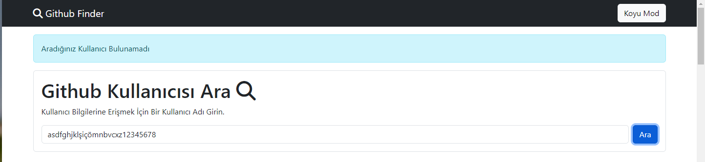
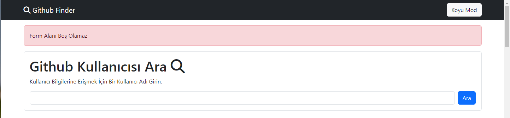
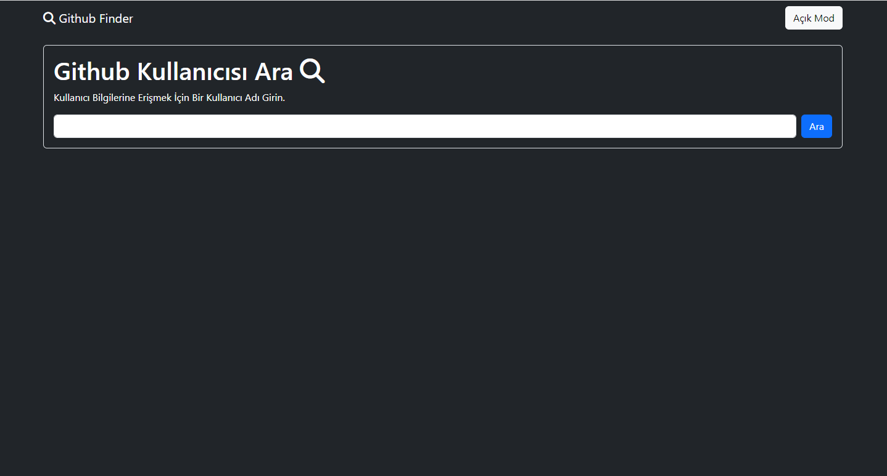

# Github Finder 
Github Hesaplarını Github API ile bulmamıza yarayan bir arama projesi.

# Kullanılan Teknolojiler
- JS 
- HTML

# Ekran Görüntü ve Kaydı

# Yol Haritası

- Input alanına yazılan yazıyı kaydet butonuna tıklanınca ve enter'a basınca al
- API linkinin sonuna ekle ve API'a get isteği at
- gelen verilere göre ekrana kullanıcı bilgi alanına bas